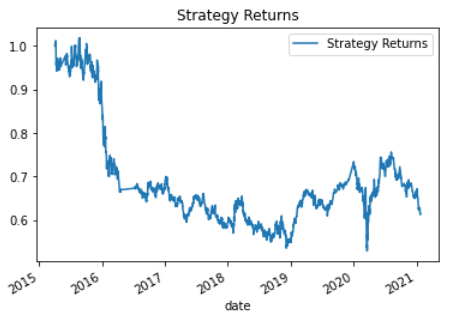

# Machine Learning Training Bot

This jupyter notebook establishes a baseline performance for a machine learning trading bot, tunes the baseline trading algorithm, evaluates a new machine learning classifier, and presents an evaluation report (provided at the end of this README file).

# Imports

To run, this worksheet imports the following:

- import pandas as pd
- import numpy as np
- from pathlib import Path
- import hvplot.pandas
- import matplotlib.pyplot as plt
- from sklearn import svm
- from sklearn.preprocessing import StandardScaler
- from pandas.tseries.offsets import DateOffset
- from sklearn.metrics import classification_report

# Use

## Establish a Baseline
First, the notebook establishes a baseline performance by importing the OHLCV data from the emerging markets ETF.  This file is contained in the Resources folder.  Then, it drops all columns except close and calculates actual returns on a daily basis.

## Trading Signals
The fast and slow simple moving averages are created.  Initially, these are set at 4 and 100 days respectively.  Those are added to the dataframe.  A buy signal is set when the actual returns are greater than or equal to zero and a sell signal is generated when the actual return column is below zero.  The strategy returns are then created and plotted.

## Split Training and Testing Datasets

The datasets are split into testing and training in order to train the ML algorithm and allow for testing of the algorithm after fitting and training.  

## The SVC Classifier

The SVC classifier model from SKLearn's SVM is fit and used to make predictions.  The following is the classification report from the SVC model's predictions.

A DataFrame is created with the columns for the Actual Returns and Strategy Returns and plotted.

## Tune the Baseline Trading Algorithm

In order to tune the baseline trading algorithm, the size of the training dataset is adjusted as well as the input features.  

The cumulative product of the actual returns vs. the strategy returns has been plotted and saved as a PNG file.  

First, the slow moving average was adjusted from 100 to 200 days.  The result was an increased bias for buy signals and a decrease in the F1 score.  Moving the slow moving average to 50 slightly improved the F1 score.  After returning the slow moving average to its original 100 days, the training sample was increased from 3 months to 5 months.  This significantly improved the results, reducing the buy signal bias and improving the F1 score from .07 to .32.  Having adjusted the dataset and the inputs features, the best result came from increasing the data that the algorithm can learn from.

## Using DecisionTreeClassifier

Next the model is changed from an SVC model to a DecisionTreeClassifier model.  The tree classifier is imported from sklearn.

After fitting and testing the dataset and creating a classification report for the DecisionTreeClassifier, it is apparent that the DTC is no better than the baseline version of the SVC. It again has a huge buy-signal bias and a low F1-score (.03).  The tuned SVC worked better, likely because it had more data when the training slice was increased to 5 months.  See below.

The plot has been saved as a PNG file.

## Evaluation

As can be seen with the above classification reports, better results are obtained when additional data is provided to the models.  Were I to continue this project, I would test LogisticRegression and DTC with additional data slices.  Also, it must be noted that the dataset itself is limited and that hinders the ability of the model to adequately predict appropriate buy and sell signals.

# Collaborators 

This project is a part of the Rice University FinTech bootcamp.

# License

This file is created under the MIT License.
